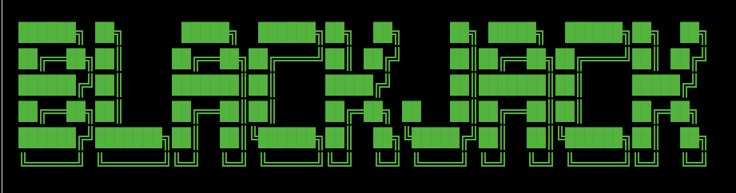
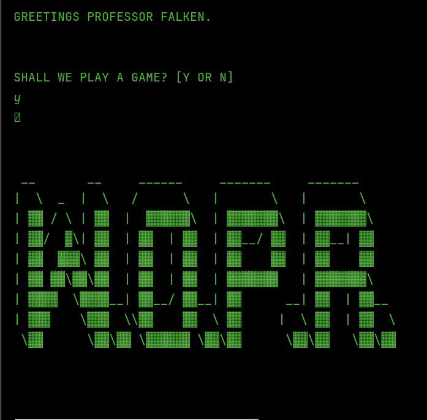
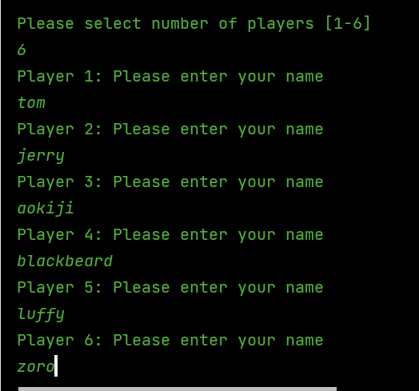
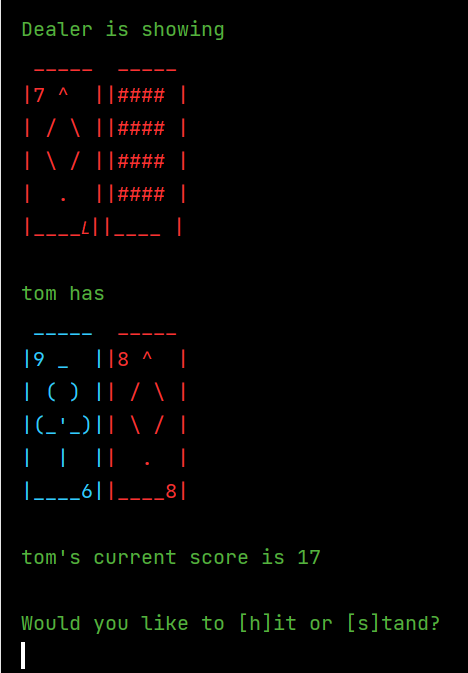
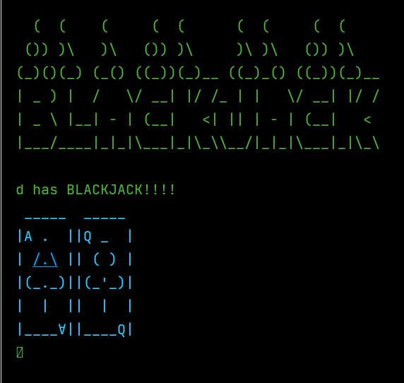
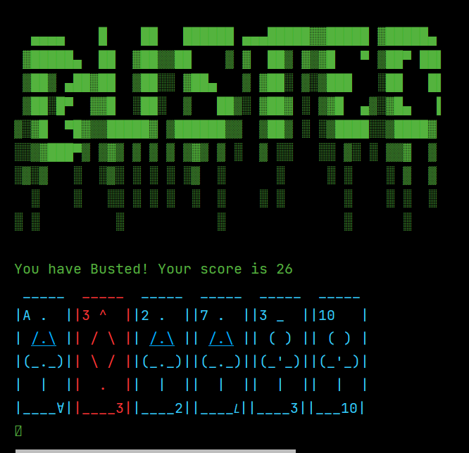

Console game based on Blackjack and War Games, 

Project Team

* Alan Pottinger
* Zach Yusuf
* Subash KC

## Project description:

Non-GUI Blackjack game

### Project Location
[JavaNinjas - Blackjack](https://github.com/zachystuff/Java_Ninjas_BlackJack)

### To start the game on the command line
>java -classpath blackjack-1.0.jar;"lib\*" com.javaninjas.blackjack.client.Main

### Rules and/or high-level basic operation of the game or application:

Card game between player(s) (1-6) and dealer to get closest to 21 without going over. Game uses a single deck of
cards.  
A deck consists of 52 cards (13 cards of each suite). Face cards are worth 10, ace can be 1 or 11, numbers equal their
number.

### General Logic

<ul> 
  <li> Select number of players and assign everyone a name.</li>
  <li> Deal two cards to each player and dealer </li>
  <li> Each player can hit (get another card) or stand (keep current cards) </li>
  <li> If players total goes over 21, they “Bust” </li>
  <li> After all players have finished, the dealer plays. </li>
  <li> Dealer must hit if initial hand is below 17, and must stand once hand is at least 17 </li>
  <li> Player hands are compared to dealer’s hand </li>
  <li> If higher than dealer, they win. If same as dealer, they push. If lower than dealer, they lose. </li>
</ul>

## Game-play & Screenshots

### Theme inspired by War Games - a 1983 American Cold war science fiction techno thriller

### Begin the game by selecting the number of players

### Players have the option to hit or stand

### Get Lucky

### Get busted when you have a score of over 21

